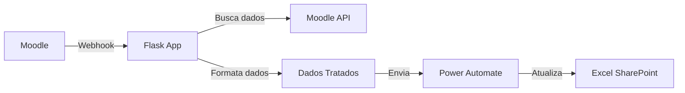

# 📊 Automação de Planilhas Excel - Moodle Integration

Sistema simples e eficiente que automatiza a transferência de dados de inscrições do Moodle para planilhas Excel no SharePoint, eliminando o trabalho manual de gestão de dados.

## 🎯 O Problema que Resolve

- ✅ **Elimina trabalho manual**: Não precisa mais copiar/colar dados de estudantes
- ✅ **Sincronização em tempo real**: Dados aparecem na planilha assim que o estudante se inscreve
- ✅ **Formatação automática**: CPF, nomes e outros dados já chegam formatados
- ✅ **Controle de indicadores**: Facilita relatórios de inscrições por curso

## 🔄 Como Funciona



**Fluxo detalhado:**
1. Estudante se inscreve ou tem inscrição atualizada no Moodle
2. Moodle envia webhook para nossa aplicação
3. App busca dados completos do estudante via API
4. Formata os dados (CPF: `123.456.789-00`, nomes capitalizados, etc.)
5. Envia para Power Automate que atualiza a planilha

## 🚀 Deploy Rápido

### Pré-requisitos
- Conta no [Fly.io](https://fly.io) (gratuito)
- [Flyctl](https://fly.io/docs/getting-started/installing-flyctl/) instalado
- Power Automate configurado (veja [guia abaixo](#-configuração-do-power-automate))

### 1. Clone e Configure

```bash
git clone https://github.com/seu-usuario/excel-automation.git
cd excel-automation
cp .envexample .env
# Edite o .env com suas configurações se quiser rodar localmente
```

### 2. Deploy no Fly.io

```bash
# Login
fly auth login

# Deploy
fly launch --no-deploy

# Configure secrets
fly secrets set MOODLE_API_TOKEN="seu_token_aqui"
fly secrets set MOODLE_API_URL="https://seu-moodle.com/webservice/rest/server.php"
fly secrets set POWER_AUTOMATE_URL="sua_url_do_power_automate"

# Deploy final
fly deploy
```

Pronto! Sua aplicação estará rodando em `https://sua-app.fly.dev`

## ⚙️ Configuração do Moodle

### 1. Webhook
Em **Administração → Plugins → Web services → Webhooks**:

- **URL**: `https://sua-app.fly.dev/webhook`
- **Eventos**: 
  - `core\event\user_enrolment_created`
  - `core\event\user_enrolment_updated`
- **Formato**: JSON

### 2. Token da API
Em **Administração → Plugins → Web services → Gerenciar tokens**:
- Criar novo token para usuário admin
- Serviço: "Moodle mobile web service"

## 🔄 Configuração do Power Automate

### 1. Criar Fluxo
1. **Gatilho**: "Quando uma solicitação HTTP é recebida"
2. **Ação**: "Adicionar uma linha à tabela" (Excel Online)

### 2. Esquema JSON do Gatilho
```json
{
    "type": "object",
    "properties": {
        "username": {"type": "string"},
        "nome_completo": {"type": "string"},
        "vinculo": {"type": "string"},
        "uf": {"type": "string"},
        "genero": {"type": "string"},
        "etinia": {"type": "string"},
        "email": {"type": "string"},
        "municipio": {"type": "string"},
        "course_fullname": {"type": "string"}
    }
}
```

### 3. Mapeamento na Planilha
| Coluna Excel | Campo do Power Automate |
|--------------|-------------------------|
| CPF | `triggerBody()?['username']` |
| Nome | `triggerBody()?['nome_completo']` |
| Vínculo | `triggerBody()?['vinculo']` |
| UF | `triggerBody()?['uf']` |
| Gênero | `triggerBody()?['genero']` |
| Etnia | `triggerBody()?['etinia']` |
| Email | `triggerBody()?['email']` |
| Município | `triggerBody()?['municipio']` |
| Curso | `triggerBody()?['course_fullname']` |

## 📋 Estrutura da Planilha Excel

Crie uma tabela no Excel Online com essas colunas:

| CPF | Nome | Vínculo | UF | Gênero | Etnia | Email | Município | Curso |
|-----|------|---------|----|---------|---------|---------|---------|---------| 
| 123.456.789-00 | João Silva | S | SP | M | Branca | joao@email.com | São Paulo | Curso Python |

## 🔍 Monitoramento

### Verificar Status
```bash
# Status da aplicação
fly status

# Ver logs em tempo real
fly logs

# Health check
curl https://sua-app.fly.dev/
```

### Campos Formatados Automaticamente

**CPF**: `12345678900` → `123.456.789-00`

**Nome**: `joão da silva` → `João da Silva`

**Vínculo**: 
- `Servidor / Empregado Público` → `S`
- `Estagiário` → `E`
- `Público Externo` → `P/Ext`

**UF**: `São Paulo - SP` → `SP`

**Gênero**: `Masculino` → `M`, `Feminino` → `F`

## 🐛 Troubleshooting

| Problema | Solução |
|----------|---------|
| Webhook não está chegando | Verifique URL e eventos no Moodle |
| Erro 401/403 | Verificar token da API do Moodle |
| Dados não aparecem na planilha | Testar Power Automate manualmente |
| App não responde | `fly logs` para ver erros |

### Teste Manual do Power Automate

```bash
curl -X POST "SUA_URL_DO_POWER_AUTOMATE" \
  -H "Content-Type: application/json" \
  -d '{
    "username": "123.456.789-00",
    "nome_completo": "João da Silva",
    "vinculo": "S",
    "uf": "SP",
    "genero": "M",
    "etinia": "Branca",
    "email": "joao@teste.com",
    "municipio": "São Paulo",
    "course_fullname": "Curso de Teste"
  }'
```

## 📊 Variáveis de Ambiente

```env
# Obrigatórias
MOODLE_API_URL=https://seu-moodle.com/webservice/rest/server.php
MOODLE_API_TOKEN=seu_token_da_api
POWER_AUTOMATE_URL=https://prod-XX.eastus.logic.azure.com:443/workflows/...

# Opcionais
FLASK_DEBUG=False
TIMEOUT=30
```

## 📁 Estrutura do Projeto

```
excel-automation/
├── app.py              # App principal Flask
├── config.py           # Configurações
├── events.py           # Processamento de eventos
├── get_data.py         # Busca e formatação de dados
├── requirements.txt    # Dependências
├── Dockerfile         # Container config
├── fly.toml           # Config do Fly.io
└── .envexample        # Template de configuração
```

## 🤝 Contribuição

1. Fork o projeto
2. Crie sua feature branch (`git checkout -b feature/nova-feature`)
3. Commit suas mudanças (`git commit -m 'Add: nova feature'`)
4. Push para a branch (`git push origin feature/nova-feature`)
5. Abra um Pull Request

## 📄 Licença

MIT License - veja [LICENSE](LICENSE) para detalhes.

## 👨‍💻 Autor

**Gustavo Barbosa** - [@Barbosa885](https://github.com/Barbosa885)

---

<p align="center">
  <strong>🎯 Simples que funciona</strong>
</p>
