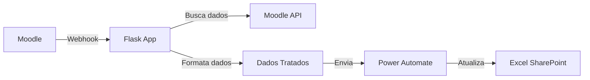

# 📊 Automação de Planilhas Excel - Moodle Integration

Sistema simples e eficiente que automatiza a transferência de dados de inscrições do Moodle para planilhas Excel no SharePoint, eliminando o trabalho manual de gestão de dados.

## 🎯 O Problema que Resolve

- ✅ **Elimina trabalho manual**: Não precisa mais copiar/colar dados de estudantes
- ✅ **Sincronização em tempo real**: Dados aparecem na planilha assim que o estudante se inscreve
- ✅ **Formatação automática**: CPF, nomes e outros dados já chegam formatados
- ✅ **Controle de indicadores**: Facilita relatórios de inscrições por curso

## 🔄 Como Funciona



**Fluxo detalhado:**
1. Estudante se inscreve ou tem inscrição atualizada no Moodle
2. Moodle envia webhook para nossa aplicação
3. App busca dados completos do estudante via API
4. Formata os dados (CPF: `123.456.789-00`, nomes capitalizados, etc.)
5. Envia para Power Automate que atualiza a planilha

## 🚀 Deploy Rápido

### Pré-requisitos
- Conta no [Fly.io](https://fly.io) (gratuito)
- [Flyctl](https://fly.io/docs/getting-started/installing-flyctl/) instalado
- Power Automate Premium (ou trial de 90 dias)

### 1. Clone e Configure (Caso for rodar localmente)

```bash
git clone https://github.com/seu-usuario/excel-automation.git
cd excel-automation
cp .envexample .env
# Edite o .env com suas configurações
```

### 2. Deploy no Fly.io (Se for a primeira vez, que não é o caso atual)

```bash
# É importante salientar que as variáveis de ambiente já estão setadas no deploy feito no fly.io.
# Faça esse passo apenas se estiver refazendo o deploy do zero ou migrando pra outra organização.
# Também é possível setar as variáveis de ambiente diretamente pela plataforma online do fly.io.  

# Login
fly auth login

# Configure secrets (primeira vez)
fly secrets set MOODLE_API_TOKEN="seu_token_aqui"
fly secrets set MOODLE_API_URL="https://seu-moodle.com/webservice/rest/server.php"
fly secrets set POWER_AUTOMATE_URL="sua_url_do_power_automate"

# Deploy
fly deploy
```

Pronto! Sua aplicação estará rodando em `https://sua-app.fly.dev`

### 🔄 Atualizando Power Automate URL (Rotina a cada 90 dias)

```bash
# Atualizar apenas a URL do Power Automate
# Também da pra fazer esse passo diretamente na plataforma do fly.io no seguinte caminho: https://fly.io/apps/excel-automation > Secrets.
fly secrets set POWER_AUTOMATE_URL="nova_url_aqui"

# Deploy para aplicar mudanças
fly deploy
```

## ⚙️ Configuração do Moodle

### 1. Webhook
Em **Administração → Plugins → Web services → Webhooks**:

- **URL**: `https://sua-app.fly.dev/webhook`
- **Eventos**: 
  - `core\event\user_enrolment_created`
  - `core\event\user_enrolment_updated`
- **Formato**: JSON

### 2. Token da API
Em **Administração → Plugins → Web services → Gerenciar tokens**:
- Criar novo token para usuário admin
- Serviço: "Moodle mobile web service"

## 🔄 Configuração do Power Automate

> ⚠️ **IMPORTANTE**: Este sistema requer **Power Automate Premium** para funcionar, pois usa o conector webhook HTTP que não está disponível na versão gratuita.

### 💡 **Contornando Limitação de Licença**

Como não temos licença Premium permanente, utilizamos o **trial de 90 dias** do Power Automate:

1. **Usar conta Microsoft empresarial do domínio @dpu.def.br** nova (ou existente sem trial usado)
2. **Ativar trial Premium** do Power Automate (90 dias gratuitos)
3. **Configurar fluxo** conforme instruções abaixo
4. **A cada 90 dias**: migrar para nova conta e atualizar URL

### 🔄 **Rotina de Renovação (A cada 3 meses)**

Quando o trial expira:

1. **Utilizar outra conta** Microsoft (Não funcioa a pessoal, tem que ser a empresarial)
2. **Ativar novo trial** Power Automate Premium  
3. **Copiar fluxo** (mesmo processo abaixo)
4. **Copiar nova URL** do gatilho HTTP
5. **Atualizar variável**:
   ```bash
   fly secrets set POWER_AUTOMATE_URL="nova_url_aqui"
   fly deploy
   ```
6. **Testar** com inscrição no Moodle

### 1. Criar Fluxo
1. **Gatilho**: "Quando uma solicitação HTTP é recebida"
2. **Ação**: "Adicionar uma linha à tabela" (Excel Online)

### 2. Esquema JSON do Gatilho
```json
{
    "type": "object",
    "properties": {
        "username": {"type": "string"},
        "nome_completo": {"type": "string"},
        "vinculo": {"type": "string"},
        "uf": {"type": "string"},
        "genero": {"type": "string"},
        "etinia": {"type": "string"},
        "email": {"type": "string"},
        "municipio": {"type": "string"},
        "course_fullname": {"type": "string"}
    }
}
```

### 3. Mapeamento na Planilha
| Coluna Excel | Campo do Power Automate |
|--------------|-------------------------|
| CPF | `triggerBody()?['username']` |
| Nome | `triggerBody()?['nome_completo']` |
| Vínculo | `triggerBody()?['vinculo']` |
| UF | `triggerBody()?['uf']` |
| Gênero | `triggerBody()?['genero']` |
| Etnia | `triggerBody()?['etinia']` |
| Email | `triggerBody()?['email']` |
| Município | `triggerBody()?['municipio']` |
| Curso | `triggerBody()?['course_fullname']` |

## 📋 Estrutura da Planilha Excel

Crie uma tabela no Excel Online com essas colunas:

| CPF | Nome | Vínculo | UF | Gênero | Etnia | Email | Município | Curso |
|-----|------|---------|----|---------|---------|---------|---------|---------| 
| 123.456.789-00 | João Silva | S | SP | M | Branca | joao@email.com | São Paulo | Curso Python |

## 🔍 Monitoramento

### Verificar Status
```bash
# Status da aplicação
fly status

# Ver logs em tempo real
fly logs

# Health check
curl https://sua-app.fly.dev/
```

### Campos Formatados Automaticamente

**CPF**: `12345678900` → `123.456.789-00`

**Nome**: `joão da silva` → `João da Silva`

**Vínculo**: 
- `Servidor / Empregado Público` → `S`
- `Estagiário` → `E`
- `Público Externo` → `P/Ext`

**UF**: `São Paulo - SP` → `SP`

**Gênero**: `Masculino` → `M`, `Feminino` → `F`

## 🐛 Troubleshooting

| Problema | Solução |
|----------|---------|
| Webhook não está chegando | Verifique URL e eventos no Moodle (`/webhook`) |
| Erro 401/403 | Verificar token da API do Moodle |
| Dados não aparecem na planilha | Testar Power Automate manualmente |
| App não responde | `fly logs` para ver erros |
| **Power Automate trial expirou** | **Renovar trial e atualizar URL** |

### ⚠️ **Erro "Power Automate Premium Required"**

Se aparecer erro sobre licença Premium:

1. ✅ **Trial expirou** - Renovar conforme [rotina acima](#-rotina-de-renovação-a-cada-3-meses)
2. ✅ **Fluxo desabilitado** - Verificar se está ativo no Power Automate  
3. ✅ **URL inválida** - Gerar nova URL do gatilho HTTP

### Teste Manual do Power Automate

```bash
curl -X POST "SUA_URL_DO_POWER_AUTOMATE" \
  -H "Content-Type: application/json" \
  -d '{
    "username": "123.456.789-00",
    "nome_completo": "João da Silva",
    "vinculo": "S",
    "uf": "SP",
    "genero": "M",
    "etinia": "Branca",
    "email": "joao@teste.com",
    "municipio": "São Paulo",
    "course_fullname": "Curso de Teste"
  }'
```

### Debug Rápido

```bash
# Ver logs em tempo real
fly logs

# Status da aplicação  
fly status

# Testar se app responde
curl https://sua-app.fly.dev/
```

## 📊 Variáveis de Ambiente

```env
# Obrigatórias
MOODLE_API_URL=https://seu-moodle.com/webservice/rest/server.php
MOODLE_API_TOKEN=seu_token_da_api
POWER_AUTOMATE_URL=https://prod-XX.eastus.logic.azure.com:443/workflows/...

# Opcionais
FLASK_DEBUG=False
TIMEOUT=30
```

> 💡 **Dica**: A `POWER_AUTOMATE_URL` muda a cada renovação de trial (90 dias). Mantenha o histórico das URLs antigas comentadas para referência.

## 📁 Estrutura do Projeto

```
excel-automation/
├── app.py              # App principal Flask - recebe webhooks
├── config.py           # Configurações e variáveis de ambiente
├── events.py           # Processamento de eventos do Moodle
├── get_data.py         # Busca e formatação de dados via API
├── requirements.txt    # Dependências Python
├── Dockerfile         # Container config para Fly.io
├── fly.toml           # Config de deploy do Fly.io
└── .envexample        # Template de configuração
```

## ⏰ Cronograma de Manutenção

### A cada 90 dias (renovação Power Automate):
1. **Semana 12** do trial: Planejar migração
2. **Semana 13** (últimos dias): 
   - Criar nova conta Microsoft
   - Configurar novo fluxo Power Automate  
   - Testar em horário de baixo movimento
3. **Dia da expiração**: 
   - Atualizar `POWER_AUTOMATE_URL`
   - Deploy: `fly deploy`
   - Monitorar logs por algumas horas

### Backup e Contingência:
- **Planilha Excel**: Backup manual semanal
- **Configurações**: Manter documento com todos os steps
- **URLs antigas**: Histórico comentado no .env para referência

## 🤝 Contribuição

1. Fork o projeto
2. Crie sua feature branch (`git checkout -b feature/nova-feature`)
3. Commit suas mudanças (`git commit -m 'Add: nova feature'`)
4. Push para a branch (`git push origin feature/nova-feature`)
5. Abra um Pull Request

## 📄 Licença

MIT License - veja [LICENSE](LICENSE) para detalhes.

## 👨‍💻 Autor

**Gustavo Barbosa** - [@Barbosa885](https://github.com/Barbosa885)

---

<p align="center">
  <strong>🎯 Automatização simples que funciona</strong>
</p>
